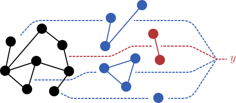
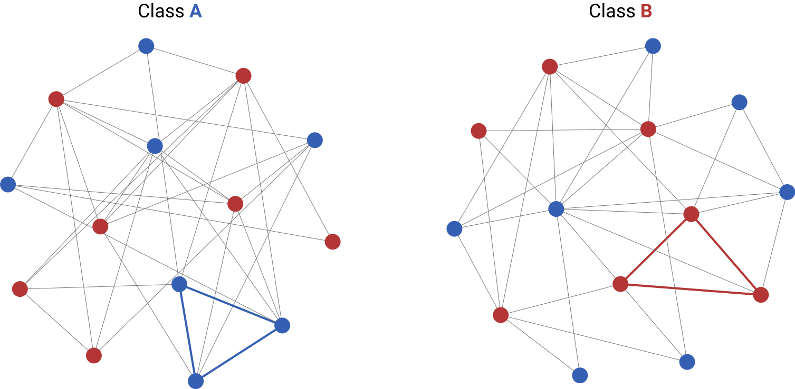
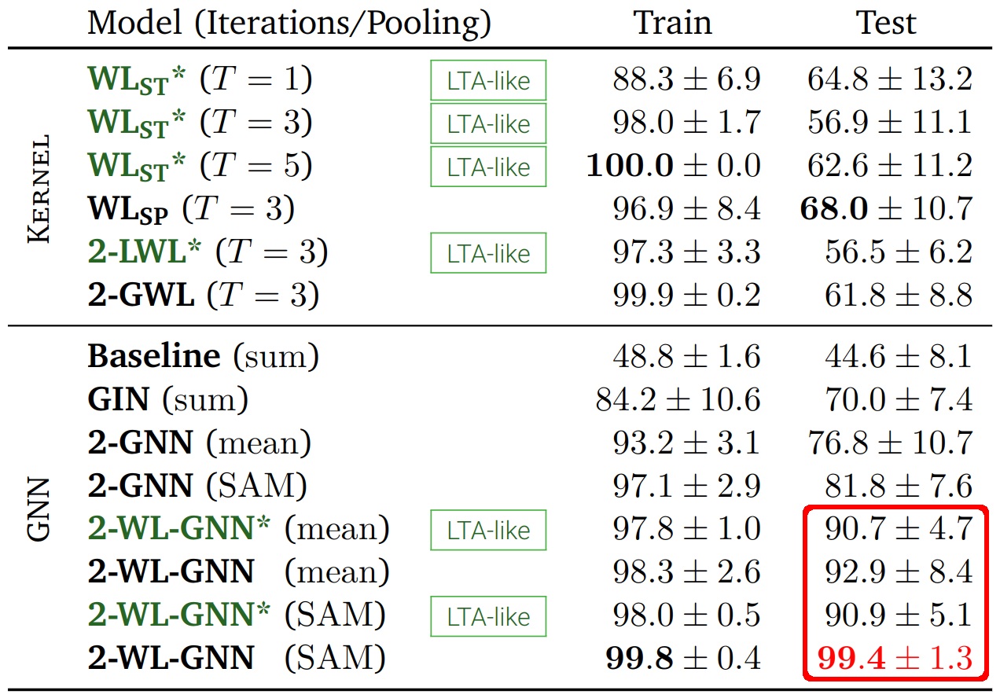

# Learning to Aggregate on Structured Data

    
  <a href="https://github.com/Cortys/master-thesis/raw/master/thesis/build/main.pdf">Thesis PDF</a> - <a href="https://github.com/Cortys/master-thesis/raw/master/presentation/final/final_presentation.pptx">Presentation Slides</a> - <a href="https://github.com/Cortys/master-thesis/tree/master/implementation">Reference Implementation</a>

## Abstract

This thesis describes the research field of graph classification and regression from the perspective of the *learning to aggregate* (LTA) problem.
It formally characterizes a selection of state-of-the-art graph kernels and *graph neural networks* (GNNs) as instances of LTA.
Those characterizations are shown to be limited by the way in which they decompose graphs.
To overcome this limitation, an avenue for a more “LTA-like” GNN is provided in form of so-called *learned edge filters*.
To realize edge filters, the novel 2-WL-GNN model is proposed; it is inspired by the two-dimensional *Weisfeiler-Lehman* (WL) algorithm and proven to be strictly more expressive than existing GNN approaches which are bounded by the more restrictive one-dimensional WL algorithm.

## Why is this interesting?

It is shown theoretically as well as experimentally that the novel **2-WL-GNN** is uniquely able to learn to find specific cyclic structures in graphs when compared against multiple alternative state-of-the-art GNN and graph kernel approaches.
This can, for example, be seen on the following *unicolored triangle detection* task:

  

Here a single triangle whose vertices all have the same label has to be found to determine the classes of randomly sampled noisy graphs.
On this binary classification task the following mean accuracies were obtained in a 10-fold evaluation:

  

